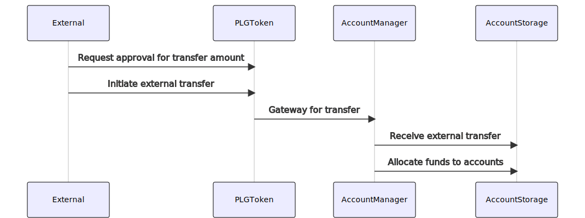
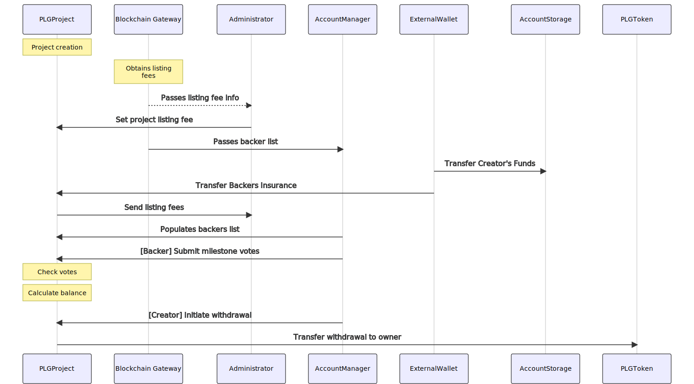
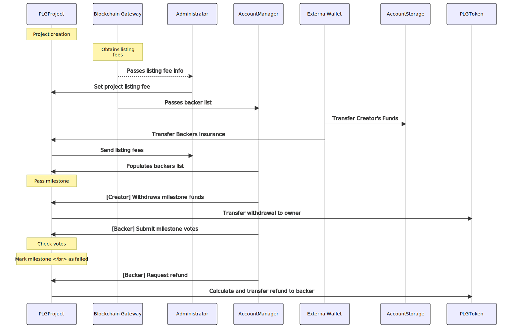
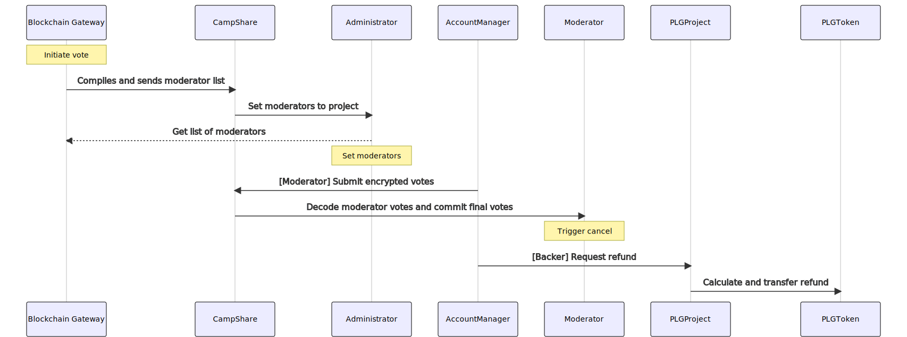
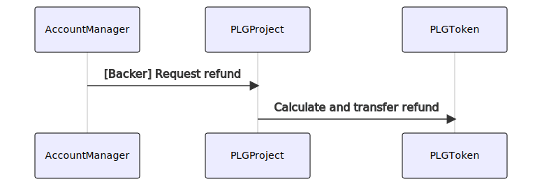
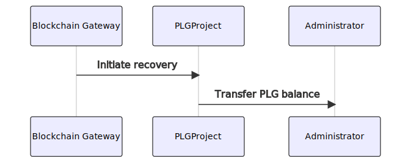
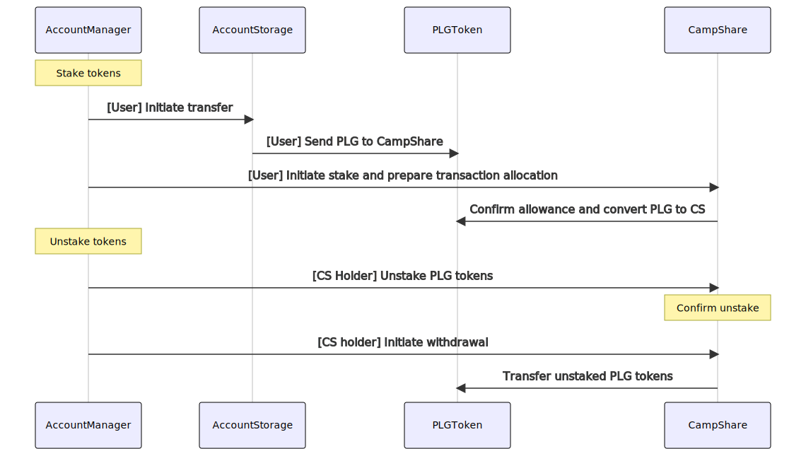
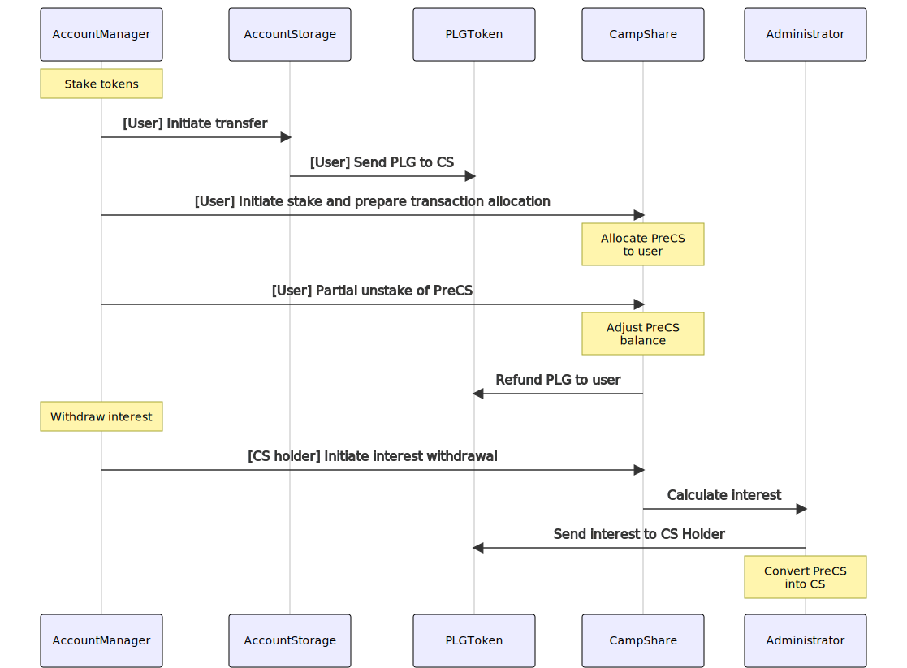
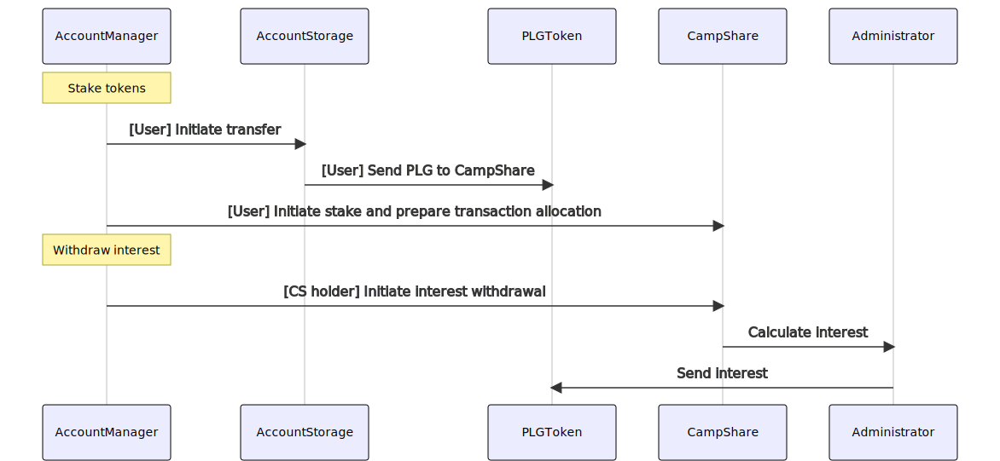

# Contract Usage

This page goes into further detail regarding the Pledgecamp contracts suite.

### PLGToken
An [ERC20 token](https://en.bitcoinwiki.org/wiki/ERC20) with ticker symbol "PLG" used to back projects. The contracts repository contains an
interface that exactly matches the one used in the public crowdsale.

### PLGProject
A Pledgecamp project starts out as a listing on [pledgecamp.com](https://pledgecamp.com), where backers can contribute funds to receive
future rewards. If a project's funding goal is met within the designated time period, a percentage of the money is automatically paid out to
the creator. The remainder of funds are converted to PLG and sent to a new instance of the PLGProject contract. The amount initially
withheld corresponds to the project's listing fee and is determined by the creator before publishing the project. Below is an example of what the fee structure could look like:

Listing Fee | Funds Withheld |
-------------|---------------- |
1% | 50% |
2% | 40% |
3% | 30% |
4% | 20% |
4.5% | 10% |
5% | 0% |

These numbers are subject to change at any time. The listing fee is dispersed among Camp Share holders (moderators), which you can read more about below.

The PLGProject contract tracks project milestones and backer insurance votes. The creator may withdraw additional funds when a milestone date is passed, as long as the weighted sum of insurance votes does not exceed 50%. If the votes do exceed 50%, backers who voted to receive refunds can withdraw a part of their original investment proportional to the amount of funds still withheld in the contract. The rest of the tokens are available to the creator, so they can attempt to complete the project with less money and fewer obligations to backers.

The contract is initialized with the following project information:

Parameter | Description |
----------|------------- |
_plgToken | The Ethereum address of the Pledge Coin contract, used for checking balances and making token transactions |
_administrator | The Ethereum address of the administrator contract, which receives the listing fee and recovers funds if something goes wrong (e.g. the creator loses control of their wallet). |
_accountStorage | The Ethereum address of the account storage contract, used for holding and transferring funds on behalf of both the creator and backers |
_creator | The Ethereum address of the project creator |
milestoneTimes | A list of milestone timestamps |
releasePercents | A list of milestone release percentages, matched to `milestoneTimes` |

Once the contract is created, its `setBackers` function is called by the account manager to record project backers, the percentage of each backer's contribution held as insurance, and the total funds received by the project.

After all backers have been recorded in the contract, they may vote to refund at any time by calling `milestoneVote`. Each vote is weighted by the amount of funds contributed by the backer. When each milestone time is reached (determined by `milestoneTimes` during initialization), `checkMilestones` must be called in order to calculate whether refund votes exceed 50%. If they do, the project state is marked as `MilestoneFailed`, backers who voted to cancel may receive their refund by calling `requestRefund`, and the creator receives the remaining tokens by calling `withdrawFunds`. If refund votes are less than or equal to 50%, the creator receives a portion of backer insurance according to the milestone's release percentage (provided by `releasePercents` during initialization).

### CampShare
This contract allows participating users to stake PLG, and receive CampShares (CS) in return at a 1:1 ratio. The contract periodically awards stakers with dividends in the form of a percentage of the PLG collected from project listing fees. The interest period will tentatively be set to three months (or 90 days), but is subject to change at any time. CS may be converted back to PLG at any time, but dividends will not be awarded for the current interest period, and the conversion is not finalized until the end of the interest period. As with all other public facing contract functionality, all CS-related actions can be done through the managed account system.  

A user can convert PLG to CS by using the standard ERC20 function `approve` to allow a transfer to the CS contract. The user then calls the CS function `acceptPLG`, which records the transfer and notes that the user should receive CS at the start of the next dividend period. During this time, the user may call `refundPLG` to immediately have their PLG returned without waiting until the end of the period.

At the end each period, `receiveDividends` must be called by each CS holder. It is taken care of automatically if CS was purchased via the managed account system. This triggers a dividend payment if the user has held CS for at least one full dividend period.

To convert CS back to PLG, the user must first call `unstakeCS`. At the end of the current dividend period, `withdrawPLG` can be called to finish the conversion.

In order to receive these dividends, CS stakers have an obligation to moderate projects. At any point in time, the platform backend may request a moderation event due to user reported TOS violations. The CS contracts select seven moderators in order of when they originally staked PLG. The moderators must vote whether or not to de-list a project within a fixed period of time (currently set to 24 hours). If any moderator misses two votes in one interest period, they forfeit dividends (and also cannot get their staked CS) for that interest period.

Currently, the implementation of CampShares is controlled by the `CampShareManager` and `CampShareStorage` contracts.  The `CampShareManager` contract controls all the functionality in the CS ecosystem and the `CampShareStorage` keeps track of the balances and transactions related to CS.

### Account Management
The account management system is split into two contracts. `AccountStorage.sol` is a mapping of user IDs to token values. It only functions to track user account balances, and enable internal and external token transfers. These transfer functions can only accessed by the contract defined in `AccountManager.sol`. The AccountManager contains functions that execute platform operations on behalf of users, including backer insurance voting, CS staking, and project moderation. PLG are transferred to or from account storage if necessary for the operation (e.g. receiving backer insurance refunds, or converting PLG to CS). Access to the AccountManager is controlled by the Pledgecamp backend server, which allows only authorized users to interact with the platform contracts via pledgecamp.com

Since the PLGProject contract may be upgraded at any point, separating the token storage from the platform actions is necessary. The storage interface is very simple, so the upgrade process can be done in just a few steps:
- Develop and audit new PLGProject contract
- Upgrade `AccountManager.sol` to match new project functionality
- Publish the contracts
- Register the new manager contract with the existing storage contract

### Administrator
This contract provides various administrative functions necessary for platform operation that don't fit with the other contracts, or generally any functionality not relating to user or balance management. It maintains a mapping of project contract addresses to listing fees, which allows creators to set up projects with private wallets, instead of the Pledgecamp account management system. This way the backer insurance rules and listing fees are still enforced, which is a requirement for being listed on pledgecamp.com.

The administrator receives listing fees after projects complete successfully, which are distributed to CS holders periodically. This is handled by the `sendDividends` function, which is a wrapper around ERC20 token transfer restricted to only allow access to the CS contract.

Finally, the administrator also allows the CS contract to assign project moderators. It maintains a mapping of moderator addresses for every project that allows the CS contract to quickly determine whether a specific Ethereum address is a moderator. The CS contract may set or clear moderator status through administrator functions.

## System flowcharts

### Project Fundraising period & Initial Fund Management

During the initial fundraising period, the project will assemble the list of project backers.  For any new users to the platform, the following process will be followed to allocate funds to their PledgeCamp account under the current managed account structure.

**Note:** At the current state, once the crowdfunding phase is complete, a portion of the funds will be transferred to the owner using the above method.  This is currently a relatively manual process.  The remaining portion will be sent to the project contracts as backer's insurance once the project is created on the blockchain.

### Project Lifecycle

**Note:** When creating a project, the gap between milestones must fall between 1 week (7 days) or 5 years (1825 days).  Release percentages for each milestone must be within in the range between 10-50%.  Anything outside these range of values will cause the project creation to prompt a warning message.

**Note 2:** Funds for the backer's insurance will be transferred to the project via the setBacker() function.

### Milestone vote failure

**Note:** Backers technically do not have to vote if they feel that the project is in a good state.  The default vote FALSE and the action of voting TRUE would mean that the backer motions to fail the milestone and initiate the refund process.  Each vote is weighted based on the amount of funds the individual backer has contributed to the project.

### Project Cancellation (Moderator vote)

**Note:** Only one chance for moderator voting is allowed per project, even if the moderation vote result does not motion a project cancellation.  The moderation vote will last for 24 hours and if after this period is up, the minimum of 7 votes has yet to be reached, additional moderators will be added on and the timer will be extended.  This process will repeat until the minimum number of moderation votes to make a final decision has been reached.  Any future revisions of the moderation period can be set through the CampShareStorage contract.

**Note 2:** The votes will all be encrypted to keep the moderation process fair and independent. A boolean vote of TRUE is a vote to motion the cancellation of a project.

**Note 3:** The moderators will have until the end of the period in which the 7th vote has been made (subject to extensions if the 7 vote requirement is not met in prior periods), in order to be eligible for interest receipts during that period.  Each moderator will be granted a grace allowance of 2 missed moderation votes per interest period (meaning their outstanding moderation count must be 2 or fewer at the end of the interest period). This number will be reset each interest period.

**Note 4:** The refund process will be processed in the same manner as a milestone failure.  In the case the moderation vote fails, the project status will remain unchanged and it will go through the milestone phase.

### Refund pledge:

**Note:** If the sale is active, return all funds. If the sale has been cancelled, return fraction of funds based on reservePercents. If a milestone has failed, return fraction of funds based on reservePercents.

### Failed milestone recovery:

**Note:** If the creator cannot access the funds, after 90 days, the administrator can transfer all the tokens in the project to the Administrator contract.

### CampShare Stake and Unstake scenario

**Note:**: CampShare is made up of 2 contracts CampShareManager and CampShareStorage.  All CampShare functionality referred to in the diagram mainly refers to CampShareManager.  CampShareStorage is designed to store all information related to CS Holdings and the basic manipulation of various balances, and will normally only be accessed through the CampShareManager contract.

**Note 2:** The account receives PreCS first and will be converted to CS at the start of the next interest period.  Backer can choose to unstake both PreCS and or CS both partially or in full at any time.

**Note 3:** The unstaking of tokens is subject to a waiting period of 30 days before the converted PLG tokens can be withdrawn by CS holder.

### Detail of CampShare staking process

**Note:**: CampShare is made up of 2 contracts CampShareManager and CampShareStorage.  All CampShare functionality referred to in the diagram mainly refers to CampShareManager.  CampShareStorage is designed to store all information related to CS Holdings and the basic manipulation of various balances, and will normally only be accessed through the CampShareManager contract.

**Note 2:** PreCS is a temporary allocation of CS to handle staking of PLG tokens in between interest periods.  PreCS may be immediately unstaked at any time before it is converted to CS and the PLG tokens will be refunded to the user.  PreCS will be converted to CS during each interest period (for new CS holders or all CS holders fulfilling their outstanding moderation requirements) at a conversion rate of 1:1.

### Interest Receipt Flow

**Note:**: CampShare is made up of 2 contracts CampShareManager and CampShareStorage.  All CampShare functionality referred to in the diagram mainly refers to CampShareManager.  CampShareStorage is designed to store all information related to CS Holdings and the basic manipulation of various balances, and will normally only be accessed through the CampShareManager contract.

**Note 2:** This process can only be initiated once after the start of every interest period.  The accrual of interest related to CS holdings will be transferred in the form of PLG tokens to the CS holder.  Holdings of Pre CS do not accrue interest.

**Note 3:** Currently, only users who have an outstanding moderation vote commitment of 2 or less at the end of the interest period can convert preCS into CS and receive interest.  The interest from CS holders who have not performed their duties and are not eligible for interest during the current interest period will be rolled over to the next interest period.  The outstanding moderation will count will be reset every interest period.
