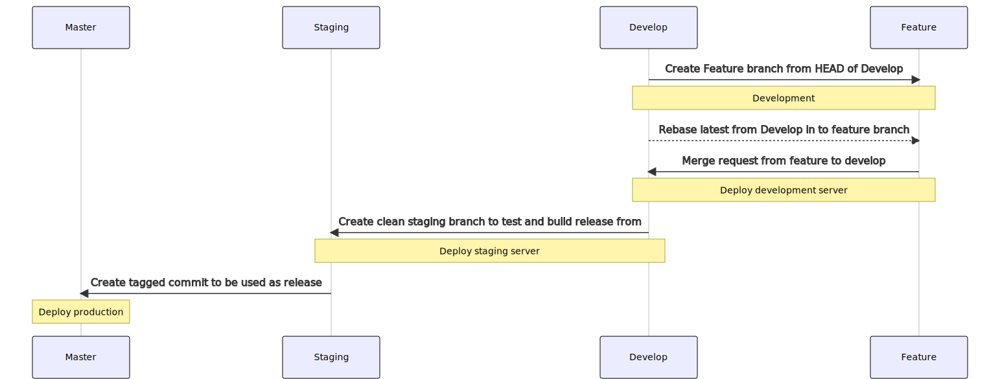

# Code Management

All code, both public and private is hosted on [Github](https://github.com/). Issues are managed through the Github interface.

[[toc]]

## Code Lifecycle

Development follows a similar model as [GIT Flow](https://nvie.com/posts/a-successful-git-branching-model/) where we have three swimlanes (branches) from which code can move right (experimental) as fast as it wants but when moving left (closer to production) the amount of checks and testing increases. The diagram below shows a typical workflow.  



In the case of emergency hotfixes which cannot wait and need to bypass the above release cycle, create a branch from the release commit itself merging back in to master and in to develop; this will hopefully be a rare event.

## Quick Start

**A golden rule for the strategy we use for code management is that `git merge` should be avoided!** In cases where code is misaligned, please read the Edge Cases section further down this page. 

The following scenario demonstrates a typical development flow for handling VCS.

```
# Make sure we have the latest develop branch
git pull origin develop

# Create a branch with type and meaningful name of change and issue number
git checkout -b feature/reward_model_updates#194

**CODING**

git commit ...

# Make sure the feature branch is compatible and up-to-date with develop branch
git fetch origin develop
git rebase develop

# Push your branch
git push -u origin feature/reward_model_updates#194

# Create the pull request, either manually or using the link provided once pushing
```

Pushing code to a feature branch keeps it isolated, easy to test, and ensures no unfinished code is
present in the develop branch. When the merge request is successful, the system automatically pushes the
latest changes to the development site.

Make sure to follow contribution guidelines for commit messages.

* Use the issue referenced in the commit title along with hash
* The title should explain what has changed
* GIT message is a bullet point list describing changes

```
#12 explain the commit in one line (use the imperative)

* Move balance check as a function that gets called from main process at startup and on interval
* Proper handling for decimal places during conversion
* Move update token balance to meta model rather than being in supportedSwaps
* fix somme usage of BigNumber
* Make display of balance on frontend use bignumber
```

### Edge Cases

#### Conflicts whilst rebasing

In cases where work you being carried out has changed both on the origin and locally, whilst rebasing, you will experience a git conflict. In this case, fix the conflict and then simply run `git rebase --continue`

#### Tidying up commits

Ideally, before pushing up changes to a remote, the git tree will be tidy but, it is not uncommon to have work-in-progress commits or commits that fix linting issues. In the case of tidying up a tree that has not yet been pushed to remote, we can simply do the following:

```
git checkout BRANCH_NAME
git rebase -i HEAD~4 #4 signifies the number of commits to go back in history
```

Running the above, will bring up an editor view showing something along the following lines:

```
pick 7b57dc0b #731 Implement the roles' keys and selectRole method
pick a2eac5b3 #731 Fix linting issues 
pick 940dcf93 #731 Add collaborator modal to manager
pick 0ae89cb0 Change social_image to social_media_image identifier
```

Because we want to remove the `Fix Linting issues`, you would replace the `pick` keyword with either `squash` or `fixup` which uses the changes but, discards the commit. You will see more options in the editor that pops up.

Once you have made the changes and exited the editor, another editor screen will open up asking you to write a new commit message and then once saved / exited will be good to push.

#### If the branch already exists remotely

In cases where the code has already been pushed to a remote, GIT will by default block the push because it causes the tree to become misaligned. So long as it is work on a feature branch, force the push using `git push --force-with-lease`.

If this push fails, it means there have been some changes on the remote branch that would be overwritten by the push. Start by making a backup of your current branch. For example

```
git checkout -b feature_backup
git fetch origin
git reset --hard origin/feature
git checkout feature
git rebase -i feature_backup
```
