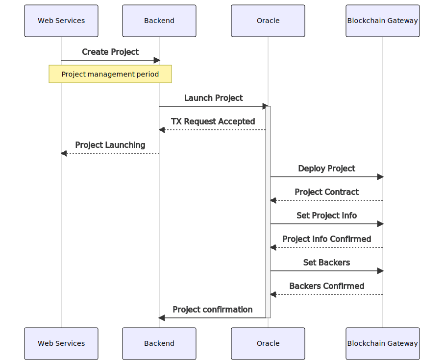
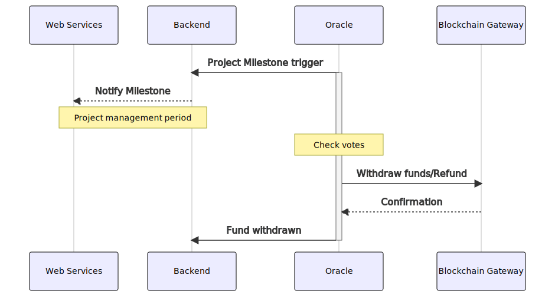
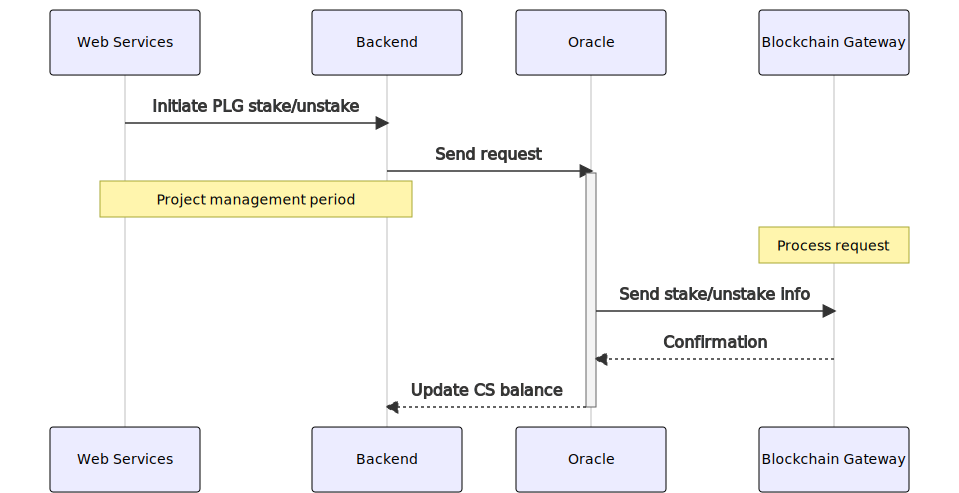
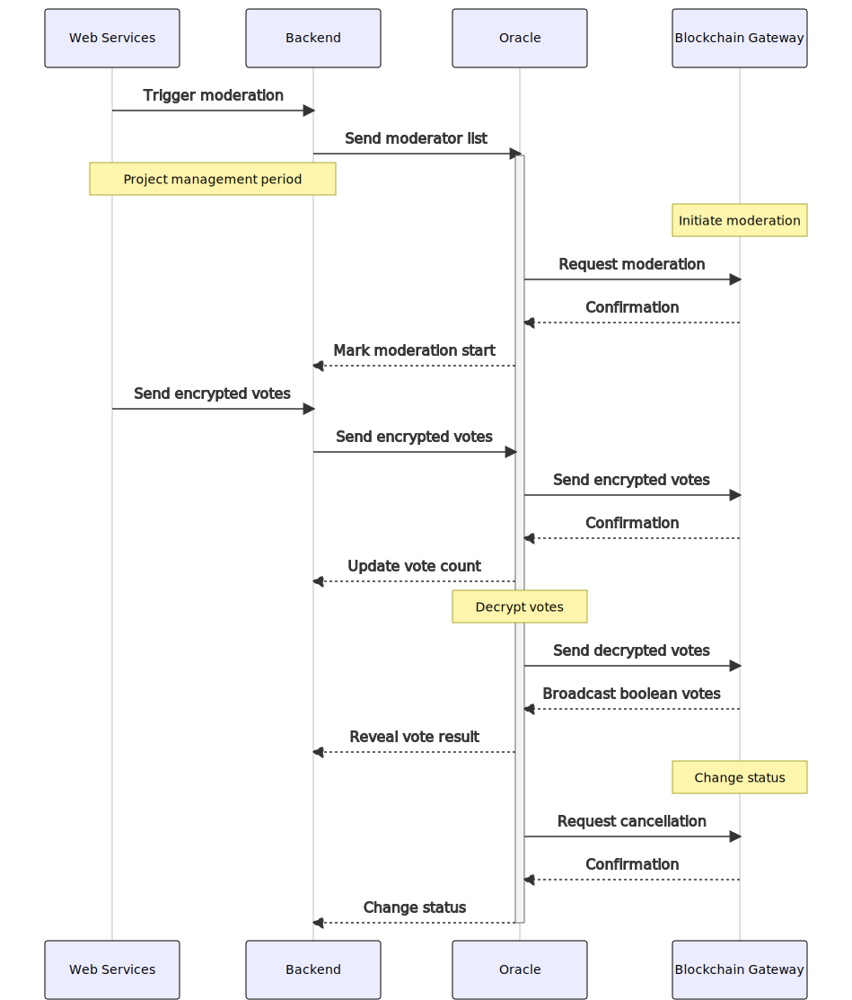
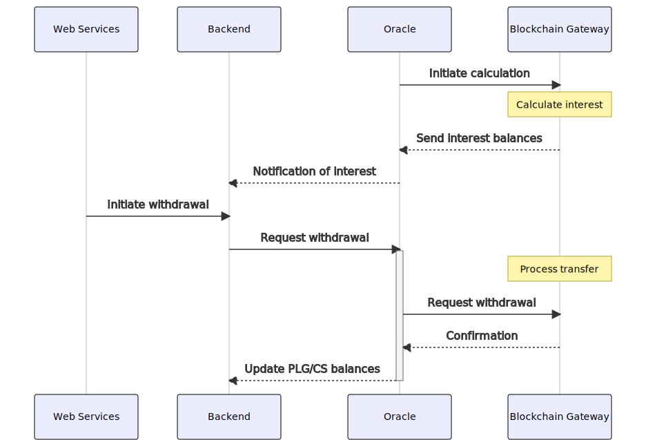

# Pledgecamp Services

This section documents existing services used to run the Pledgecamp Platform.

- [Frontend](./frontend/) - Pledgecamp platform website that interfaces with the backend.
- [Backend](./backend/) - Backend service consumed by the frontend, and interfaces with the Oracle.
- [Oracle](./oracle/) - Service for tracking blockchain state and controlling Pledgecamp blockchain interaction at a high level
- [Blockchain Gateway](./gateway/) - Direct interface to Pledgecamp smart contract functionality
- [Token Bridge](./tokenbridge/) - Service for converting between PLG on different blockchains

## Summary

This section of the documentation explains how the Pledgecamp platform works from a high level perspective.

In the first phase of development, the smart contracts will be used primarily for the backer insurance and project milestone fund reviews. For the core Pledgecamp platform, there are four service layers:

* **Web Services** - Web pages and mobile apps that make use of external APIs
* **Backend** - The Python Flask public API.
* **Oracle** - Project state management and lifecycle tracking
* **Blockchain Gateway** - Blockchain interface server

### Backer Insurance Launch Workflow

Creation of projects on the blockchain typically occurs after the fundraising of the project has succeeded in meeting its target.  When a
project is deployed to the blockchain, the milestone dates and percentage of funds to release at each step are defined.

At this point, the backers themselves are also linked to the project.

### Milestone Funds Release Workflow

To be tracked by the Oracle service, at periods of time defined within the `Project` contract, there will need to be a vote on whether to release tokens to the owner or refund.

### CampShares Staking/Unstaking Workflow

Users have the option of pledging their PLG tokens for CS. Once users send requests through the web services to the Blockchain Gateway, their accounts will be updated accordingly and their CS, along with any interest, will be credited during every interest period.  Unstaking will follow the unstaking period outlined in the contracts.

Only users who have passed KYC will be allowed to own CS.

### Project Moderation Workflow

Once the threshold has been triggered to start the project moderation process, the web services send a request to the backend to initiate the moderation.  

The backend then selects a list of moderators from the pool of CS holders and send that list to the Blockchain Gateway.  The Blockchain Gateway will kick start the moderation process and accept votes from the Web Services and tally the votes.  

Once the required number of votes has been met, a request can be made from the web services to the Blockchain Gateway to officially cancel the project.  The Blockchain Gateway will then mark the project as cancelled.

### Interest Receipt Workflow

Interest in PLG will be credited to CS holders every interest period.

Upon concluding an interest period, the Blockchain Gateway will send a notification to the backend informing users that interest is available for withdrawal.  The users can then withdraw their interest through the web services and the Blockchain Gateway will mark the interest as withdrawn and credit their accounts.  

Any CS purchased in between interest periods will also be reflected in this workflow.

